<!-- 헤더 배너 -->

<!-- 타이핑 효과 -->

<!-- 중앙 히어로 -->

---

## 🌿 About Me

시스템·네트워크 엔지니어로서 인프라와 기술의 안정성을 다루는 동시에,
명상가이자 고양이 집사로서 마음의 균형과 따뜻함을 추구합니다.

현재는 **AI 부트캠프**를 통해 인공지능의 본질과 응용 기술을 탐구하며,
미래에는 AI 엔지니어로 성장해 **기술과 인간의 조화**를 이루는 솔루션을 만들고 싶습니다.

## ⚙️ Tech & Tools

**💡 Infra / DevOps** 

**📊 Data / AI** 

## 🧭 What I'm Exploring

- 🌱 **AI Engineering & MLOps**
- 🧘 **Mindfulness + AI** — 기술로 마음을 치유하는 프로젝트
- 🐈 **반려동물의 건강과 행복**을 위한 스마트 서비스

## 📊 GitHub Stats

  
  
   
  

<!-- 잔디 뱀 (5번 항목 설정 후) -->

  <picture>
    <source media="(prefers-color-scheme: dark)" srcset="https://raw.githubusercontent.com/juny79/juny79/output/github-snake-dark.svg">
    
  </picture>

## 🌈 My Philosophy

> 기술은 인간을 대신하는 것이 아니라,
> 인간을 더 **‘인간답게’** 만들어 주는 길이라고 믿습니다.

## 🐾 Fun Facts

🐱 우리 집 고양이들 (펼쳐보기)

- 🌈 **보리** — 무지개다리 너머에서도 영원히 제 마음속에 있어요
- 🐈 **콩이**, **태리** — 오늘도 저의 하루를 책임지는 집사 상사님들
- 명상과 음악, 그리고 고양이의 하루를 관찰하는 걸 좋아합니다.
- 코드와 명상 모두 **“흐름(Flow)”** 이 중요하다고 믿습니다.

## 📫 Contact

  
  
  

 

⭐️ *"코드는 나의 명상, 시스템은 나의 정원."*

